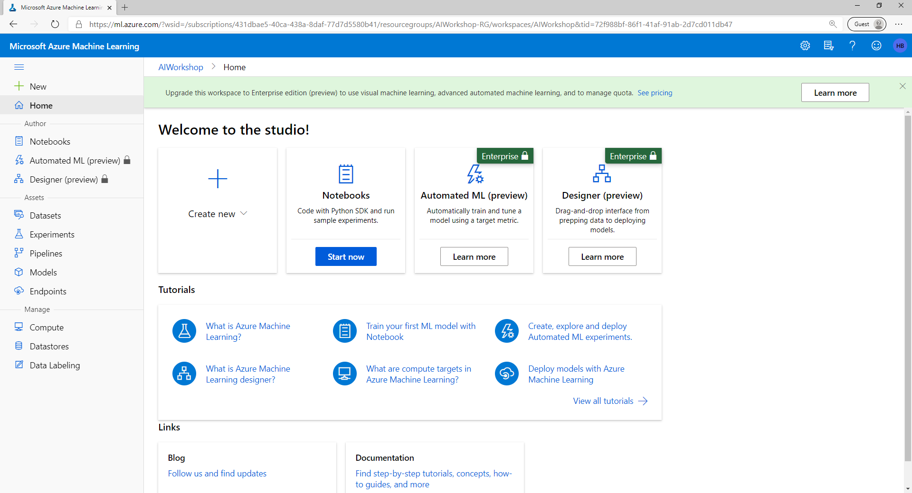
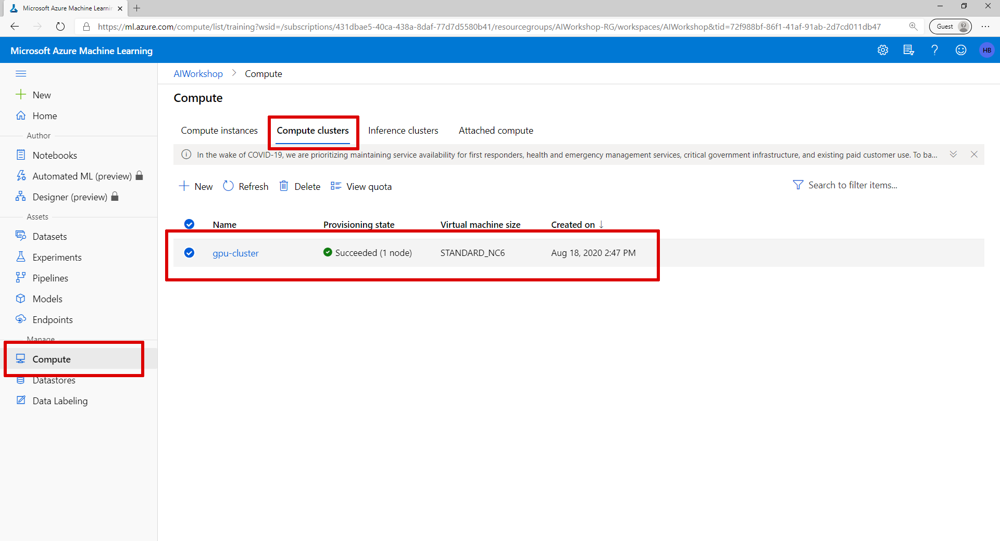
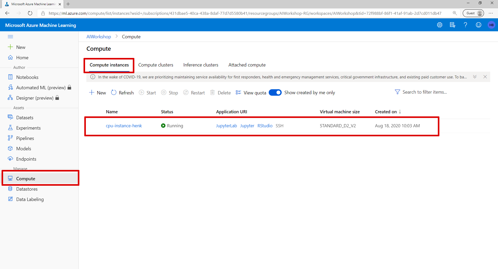
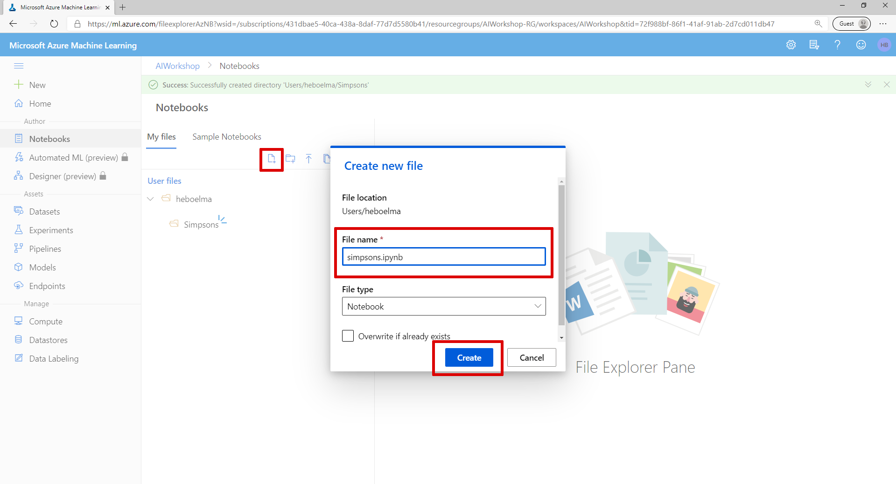
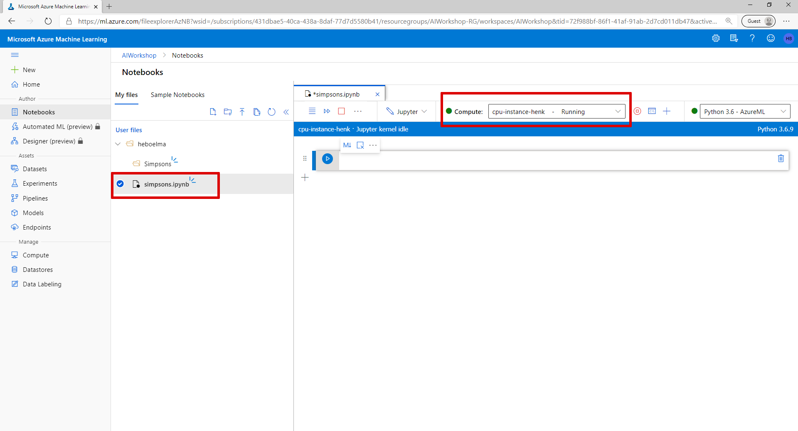

# Azure Machine Learning 


## Create a Azure Machine Learning Workspace

To get started we need to setup a few resources in Azure. For this we are going to use the Azure CLI. If you don’t have the 
[Azure CLI](https://docs.microsoft.com/en-us/cli/azure/?WT.mc_id=aiapril-blog-heboelma&view=gaic-github-latest) 
installed on your machine you can follow the 
[tutorial on MS Docs](https://docs.microsoft.com/en-us/cli/azure/install-azure-cli?WT.mc_id=gaic-github-heboelma&view=azure-cli-latest) here.


### Install the Azure Machine Learning CLI extention
To install the machine learning extension, use the following command:
```
az extension add -n azure-cli-ml
```

### Create a resource group
The Azure Machine Learning workspace must be created inside a resource group. You can use an existing resource group or create a new one. To create a new resource group, use the following command. Replace <resource-group-name> with the name to use for this resource group. Replace <location> with the Azure region to use for this resource group:
```
az group create --name <resource-group-name> --location <location>
```

### Create the workspace
To create a new workspace where the services are automatically created, use the following command:
```
az ml workspace create -w <workspace-name> -g <resource-group-name>
```

> You can now view your workspace by visiting [https://ml.azure.com](https://ml.azure.com)




### Connect to your workspace

Create a empty directory and connect to your workspace
```
md c:\temp\amls
cd c:\temp\amls
az ml folder attach -w <workspace-name> -g <resource-group-name>
```

### Create a Compute Cluster
To train our model we need an Azure Machine Learning Compute cluster. To create a new compute cluster, use the following command.   

This command will create a Azure Machine Learning Compute cluster with 1 node that is always on and is using STANDARD_NC6 virtual Machines.

*To speed up the training process you can use a GPU enabled NV6 machine*

```
az ml computetarget create amlcompute -n cpu-cluster --min-nodes 1 --max-nodes 1 --vm-size STANDARD_NC6
```

> View your created Azure Machine Learning Compute cluster on [https://ml.azure.com](https://ml.azure.com)




### Create a Compute instance

To train our model we are going to use a notebook. To run a notebook in Azure Machine Learning studio we need to create a Compute Instance.

*Choose a unique name*

```
az ml computetarget create computeinstance -n <name> --vm-size Standard_D2_V2
```

> View your created Azure Machine Learning Compute cluster on [https://ml.azure.com](https://ml.azure.com)



### Create a Notebook

- Navigate to the Notebook section in Azure Machien Learning Studio. 
- Create a new file with name 'simpsons' and File type 'notebook'




### Setup completed

If everything went correctly you should be looking at a screen that looks like the one below and see that your notebook is running on you created Compute Instance.



----

**[Continue with lab 2 >](lab-2.md)**

