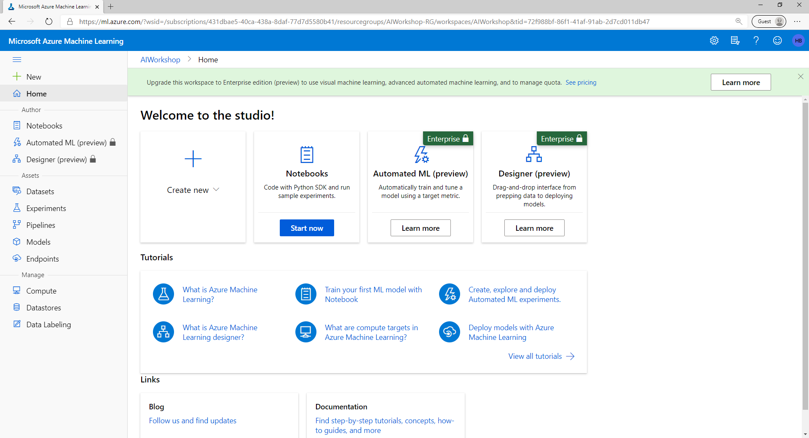
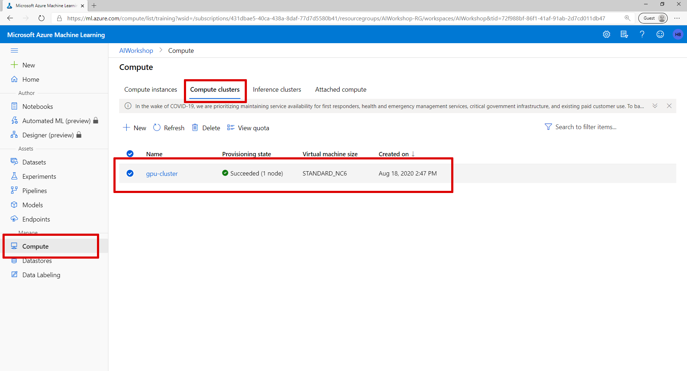
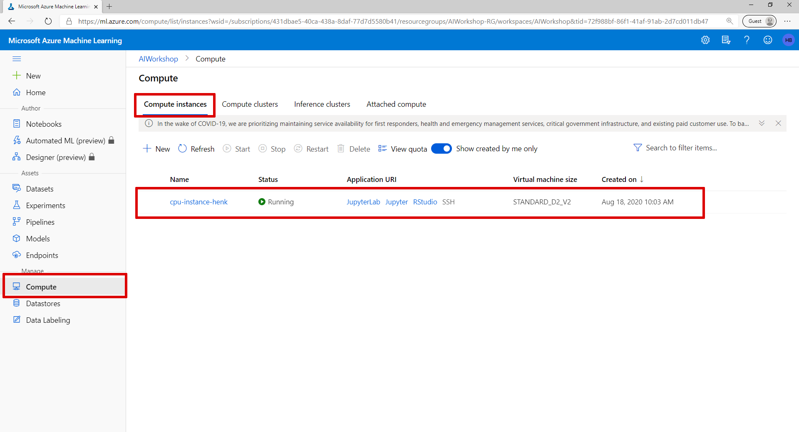
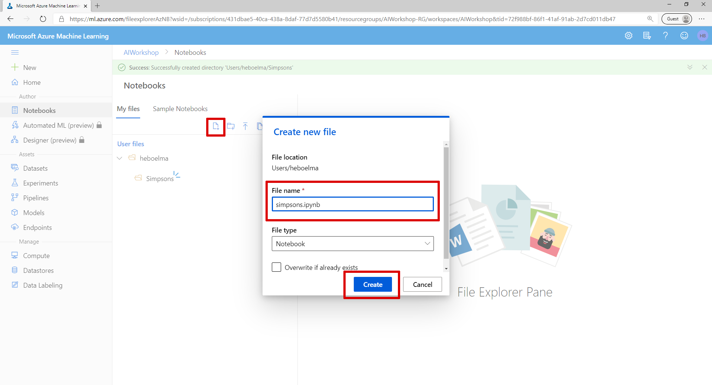
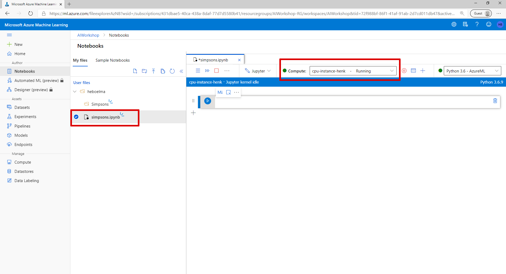

# Lab 1 - Environment Setup

## Create a Azure Machine Learning Workspace

To get started we need to setup a few resources in Azure. For this we are going to use the Azure CLI. If you don’t have the [Azure CLI](https://docs.microsoft.com/en-us/cli/azure/?WT.mc_id=aiapril-blog-heboelma&view=gaic-github-latest) installed on your machine you can follow the [tutorial on MS Docs](https://docs.microsoft.com/en-us/cli/azure/install-azure-cli?WT.mc_id=gaic-github-heboelma&view=azure-cli-latest) here.

### Install the Azure Machine Learning CLI extension

To install the machine learning extension, use the following command:

```text
az extension add -n azure-cli-ml
```

### Create a resource group

The Azure Machine Learning workspace must be created inside a resource group. You can use an existing resource group or create a new one. To create a new resource group, use the following command. Replace  with the name to use for this resource group. Replace  with the Azure region to use for this resource group:

**Example name and location:** 

* resource group name: pytorchworkshop
* location: WestEurope

```text
az group create --name <resource-group-name> --location <location>
```

### Create the workspace

To create a new workspace where the services are automatically created, use the following command:

```text
az ml workspace create -w <workspace-name> -g <resource-group-name>
```

> You can now view your workspace by visiting [https://ml.azure.com](https://ml.azure.com)



### Create a Compute Cluster

To train our model we need an Azure Machine Learning Compute cluster. To create a new compute cluster, use the following command.

This command will create an Azure Machine Learning Compute cluster with 1 node that is always on and is using STANDARD\_NC6 virtual Machines.

_To speed up the training process you can use a GPU enabled NC6 machine_

```text
az ml computetarget create amlcompute -n gpu-cluster --min-nodes 1 --max-nodes 1 --vm-size STANDARD_NC6 -w <workspace-name> -g <resource-group-name>
```

> View your created Azure Machine Learning Compute cluster on [https://ml.azure.com](https://ml.azure.com)
>
> _Creating compute can take a few minutes to complete_



### Create a Compute instance

To train our model we are going to use a notebook. To run a notebook in Azure Machine Learning studio we need to create a Compute Instance.

_Choose a unique name_

```text
az ml computetarget create computeinstance -n <name> --vm-size Standard_D2_V2 -w <workspace-name> -g <resource-group-name>
```

> View your created Azure Machine Learning Compute cluster on [https://ml.azure.com](https://ml.azure.com)
>
> _Creating compute can take a few minutes to complete_



### Create a Notebook

* Navigate to the Notebook section in Azure Machine Learning Workspace. 
* Create a new file with name 'simpsons' and File type 'notebook'



### Setup completed

If everything went correctly you should be looking at a screen that looks like the one below and see that your notebook is running on your created Compute Instance.



[**Continue with lab 2 &gt;**](lab-2.md)

