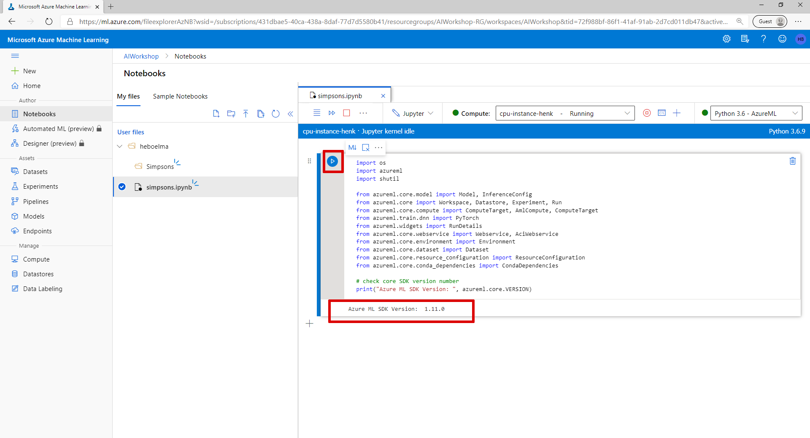
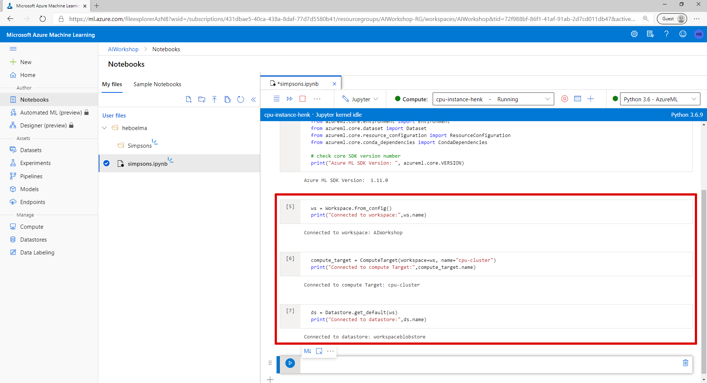
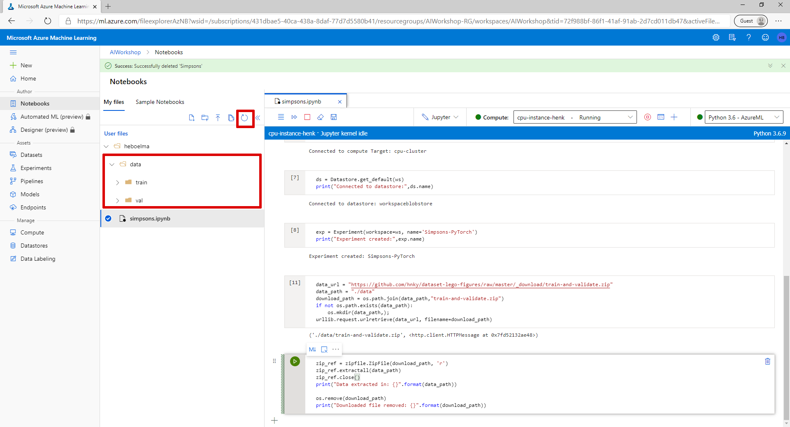
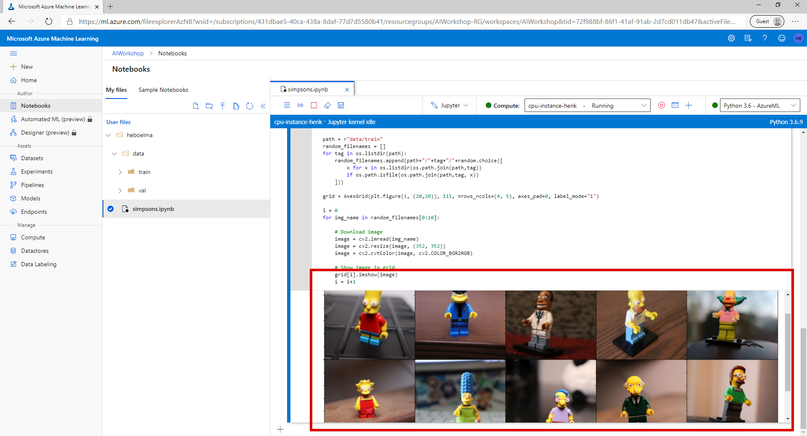
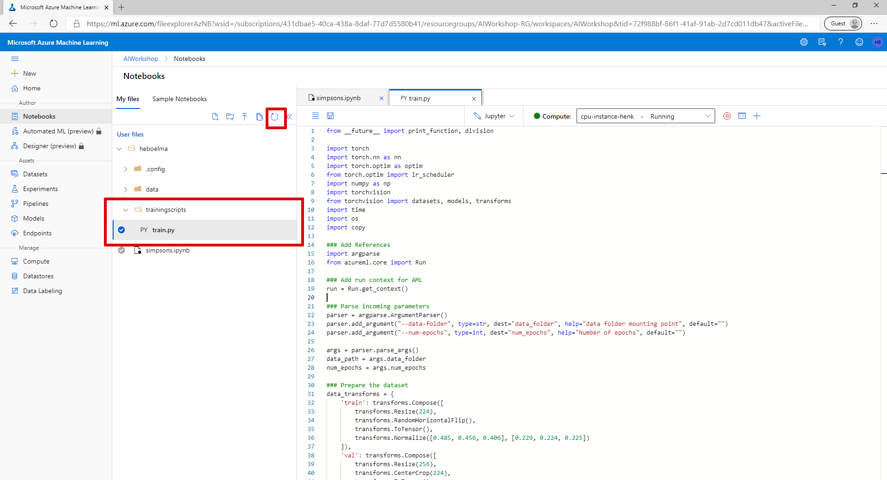
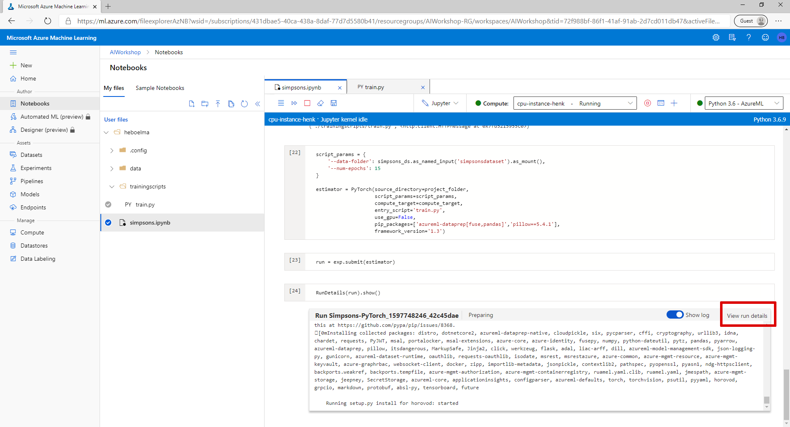
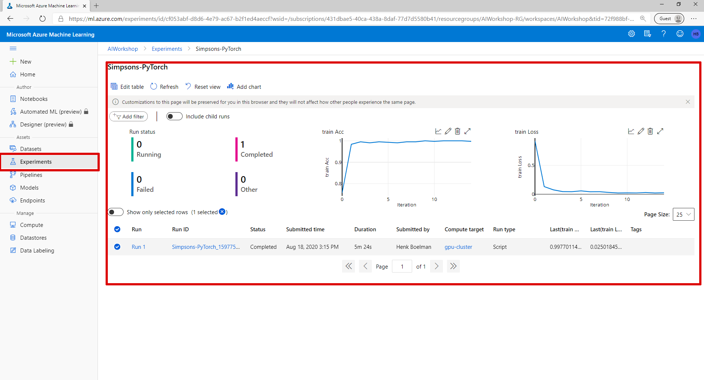
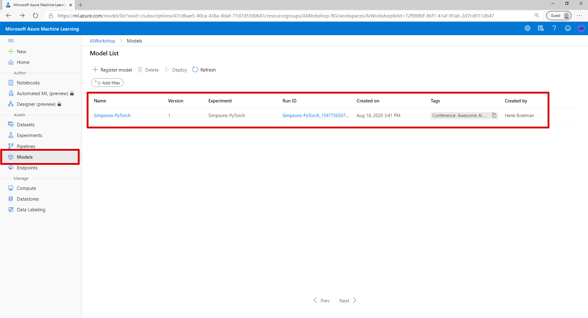
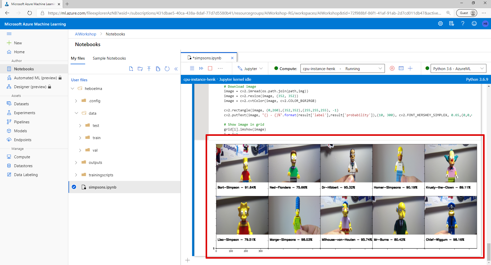

# Lab 2 - Train your model

In this lab we are going the train a PyTorch Model that can classify Simpsons using the resources we have created in the [previous lab](lab-1.md).

## 1. Connect to your resources

### Import dependencies

Start with importing dependencies. If you are using a Notebook in Azure Machine Learning Studio, you have all the latest versions install. If you are running your own Jupyter notebook then you have to install the azureml-sdk \(pip install azureml-sdk\).

* Paste the code below in the first cell and run this cell.

```text
import os
import azureml
import shutil
import urllib.request
import zipfile


from azureml.core.model import Model, InferenceConfig
from azureml.core import Workspace, Datastore, Experiment, Run
from azureml.core.compute import ComputeTarget, AmlCompute, ComputeTarget
from azureml.train.dnn import PyTorch
from azureml.widgets import RunDetails
from azureml.core.webservice import Webservice, AciWebservice
from azureml.core.environment import Environment
from azureml.core.dataset import Dataset
from azureml.core.resource_configuration import ResourceConfiguration
from azureml.core.conda_dependencies import CondaDependencies 

# check core SDK version number
print("Azure ML SDK Version: ", azureml.core.VERSION)
```



### Connect to workspace

* Create a new code cell by clicking on the '+ Code' button
* Paste the code below

  ```text
  ws = Workspace.from_config()
  print("Connected to workspace: ",ws.name)
  ```

* Run the cell
* Performing the interactive authentication using the link and code provide
* Run the cell again
* It should say: "Connected to workspace: "

### Connect to Azure Machine Learning Compute Cluster

```text
compute_target = ComputeTarget(workspace=ws, name="gpu-cluster")
print("Connected to compute target:",compute_target.name)
```

### Connect to the default datastore

```text
ds = Datastore.get_default(ws)
print("Connected to datastore:",ds.name)
```



### Create an experiment

```text
exp = Experiment(workspace=ws, name='Simpsons-PyTorch')
print("Experiment created:",exp.name)
```

> View your created experiment on: [https://ml.azure.com](https://ml.azure.com/experiments)

## 2. Data

### Download the dataset from Github

```text
data_url = "https://github.com/hnky/dataset-lego-figures/raw/master/_download/train-and-validate.zip"
data_path = "./data"
download_path = os.path.join(data_path,"train-and-validate.zip")
if not os.path.exists(data_path):
    os.mkdir(data_path,);
urllib.request.urlretrieve(data_url, filename=download_path)
```

### Unzip the dataset

```text
zip_ref = zipfile.ZipFile(download_path, 'r')
zip_ref.extractall(data_path)
zip_ref.close()
print("Data extracted in: {}".format(data_path))

os.remove(download_path)
print("Downloaded file removed: {}".format(download_path))
```

> View your the downloaded dataset: [https://ml.azure.com](https://ml.azure.com/fileexplorerAzNB)



### Preview the dataset

To take a peak at the images in the dataset paste and the run the code below.

```text
from mpl_toolkits.axes_grid1 import AxesGrid
import random
import cv2
import matplotlib.pyplot as plt

path = r"data/train"
random_filenames = []
for tag in os.listdir(path):
    random_filenames.append(path+"/"+tag+"/"+random.choice([
        x for x in os.listdir(os.path.join(path,tag))
        if os.path.isfile(os.path.join(path,tag, x))
    ]))

grid = AxesGrid(plt.figure(1, (20,20)), 111, nrows_ncols=(4, 5), axes_pad=0, label_mode="1")

i = 0
for img_name in random_filenames[0:10]:
    image = cv2.imread(img_name)
    image = cv2.resize(image, (352, 352))
    image = cv2.cvtColor(image, cv2.COLOR_BGR2RGB)

    # Show image in grid
    grid[i].imshow(image)
    i = i+1
```



### Upload the data to the datastore

```text
ds.upload(src_dir=data_path, target_path='simpsonslego', overwrite=True, show_progress=True)
```

### Create a dataset from the data in the datastore

```text
datastore_paths = [(ds, 'simpsonslego/**')]
simpsons_ds = Dataset.File.from_files(path=datastore_paths)
```

### Register the dataset

```text
simpsons_ds.register(workspace=ws,
             name='LegoSimpsons',
             description='Simpsons dataset with Lego Figures',
             create_new_version = True)
```

### Connect to the dataset

```text
simpsons_ds = Dataset.get_by_name(ws, name='LegoSimpsons')
```

## Train the model

### Download the training script

```text
project_folder = "./trainingscripts"

training_script_url = "https://raw.githubusercontent.com/hnky/DevelopersGuideToAI/master/amls/resources/train.py"

training_script_download_path = os.path.join(project_folder,"train.py")
if not os.path.exists(project_folder):
    os.mkdir(project_folder);
urllib.request.urlretrieve(training_script_url, filename=training_script_download_path)
```

> Refresh your files and validate that 'train.py' is downloaded in the folder 'trainingscripts': [https://ml.azure.com](https://ml.azure.com/fileexplorerAzNB)



```text
curated_env_name = 'AzureML-PyTorch-1.6-GPU'

pytorch_env = Environment.get(workspace=ws, name=curated_env_name)
pytorch_env = pytorch_env.clone(new_name='pytorch-1.6-gpu')
```

```text
args = [
    '--data-folder', simpsons_ds.as_named_input('simpsons').as_mount(),
    '--num-epochs', 15
]

project_folder = "./trainingscripts"

config = ScriptRunConfig(
    source_directory = project_folder, 
    script = 'train.py', 
    compute_target=compute_target,
    environment = pytorch_env,
    arguments=args,
)
```

### Create the PyTorch estimator

```text
script_params = {
    '--data-folder': simpsons_ds.as_named_input('simpsonsdataset').as_mount(),
    '--num-epochs': 15
}

estimator = PyTorch(source_directory=project_folder, 
                    script_params=script_params,
                    compute_target=compute_target,
                    entry_script='train.py',
                    use_gpu=True,
                    pip_packages=['azureml-dataprep[fuse,pandas]','pillow==5.4.1'],
                    framework_version='1.3')
```

### Submit the PyTorch estimator

```text
run = exp.submit(estimator)
```

### Follow the progress of the run

```text
RunDetails(run).show()
```

* Click on 'View run details' to view all the details of the run under the experiment.



> **This step can take up to 15 minutes to complete**



### Register the model

```text
model = run.register_model(model_name='Simpsons-PyTorch',
                           model_path='outputs',
                           model_framework='PyTorch',
                           model_framework_version='1.3',
                           description="Simpsons PyTorch Classifier",
                           tags={'Conference':'Awesome AI Workshop'},
                           resource_configuration=ResourceConfiguration(cpu=1, memory_in_gb=2))

print("Model '{}' version {} registered ".format(model.name,model.version))
```



> Validate that your model is visible under 'Models': [https://ml.azure.com](https://ml.azure.com/model/list)

## Download and test your model

### Download the model

```text
model.download(exist_ok=True)
```

### Download test images

```text
test_images_url = "https://github.com/hnky/dataset-lego-figures/raw/master/_download/test-images.zip"
test_images_path = r"./data/test"
test_images_download_path = os.path.join(test_images_path,"test-images.zip")
if not os.path.exists(test_images_path):
    os.mkdir(test_images_path,);
urllib.request.urlretrieve(test_images_url, filename=test_images_download_path)
```

### Unzip test images

```text
zip_ref = zipfile.ZipFile(test_images_download_path, 'r')
zip_ref.extractall(test_images_path)
zip_ref.close()
print("Data extracted in: {}".format(test_images_path))

os.remove(download_path)
print("Downloaded file removed: {}".format(test_images_download_path))
```

### Run the model over the test images

```text
import os
import torch
import torch.nn as nn
import torchvision
from torchvision import transforms
import json
import urllib
from PIL import Image

# Load the model
loaded_model = torch.load(os.path.join('outputs','model.pth'), map_location=lambda storage, loc: storage)
loaded_model.eval()

# Load the labels
with open(os.path.join('outputs','labels.txt'), 'rt') as lf:
    global labels
    labels = [l.strip() for l in lf.readlines()]


def scoreImage(image_link):
    # Load the image to predict
    input_image = Image.open(image_link)

    # Pre process
    preprocess = transforms.Compose([
        transforms.Resize(225),
        transforms.CenterCrop(224),
        transforms.ToTensor(),
        transforms.Normalize(mean=[0.485, 0.456, 0.406], std=[0.229, 0.224, 0.225]),
    ])
    input_tensor = preprocess(input_image)
    input_batch = input_tensor.unsqueeze(0)

    # Predict the image
    if torch.cuda.is_available():
        input_batch = input_batch.to('cuda')
        loaded_model.to('cuda')

    with torch.no_grad():
        output = loaded_model(input_batch)

    index = output.data.cpu().numpy().argmax()
    probability = torch.nn.functional.softmax(output[0], dim=0).data.cpu().numpy().max()

    #Return the result
    return {"label": labels[index], "probability": round(probability*100,2)}

path = r"data/test"
grid = AxesGrid(plt.figure(1, (20,20)), 111, nrows_ncols=(4, 5), axes_pad=0, label_mode="1")

i = 0
for img in os.listdir(path):

    #Score the image
    result = scoreImage(os.path.join(path,img))

    # Download image
    image = cv2.imread(os.path.join(path,img))
    image = cv2.resize(image, (352, 352))
    image = cv2.cvtColor(image, cv2.COLOR_BGR2RGB)

    cv2.rectangle(image, (0,260),(352,352),(255,255,255), -1)
    cv2.putText(image, "{} - {}%".format(result['label'],result['probability']),(10, 300), cv2.FONT_HERSHEY_SIMPLEX, 0.65,(0,0,0),2,cv2.LINE_AA)    

    # Show image in grid
    grid[i].imshow(image)
    i = i+1
```



[**Continue with lab 3 &gt;**](lab-3.md)

