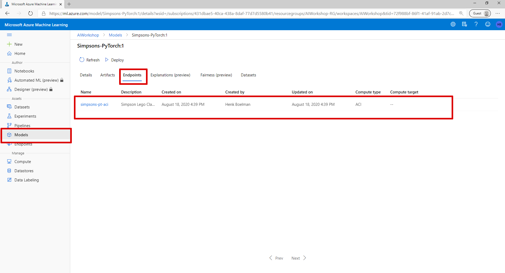
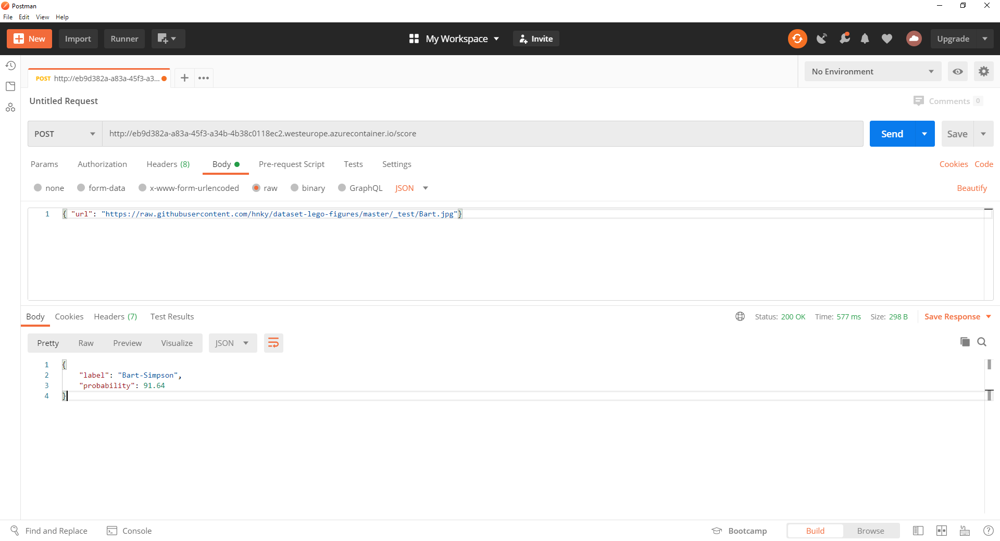

# Lab 3 - Deploy your model

In this lab we are going to deploy the model wrappend in an API in an Azure Container Instance and sending data to it with postman.

## 1. Deploy to an Azure Container Instance

### Download the scoring script

```text
inference_folder = "./inference"

inference_script_url = "https://raw.githubusercontent.com/hnky/DevelopersGuideToAI/master/amls/resources/score.py"
inference_script_download_path = os.path.join(inference_folder,"score.py")
if not os.path.exists(inference_folder):
    os.mkdir(inference_folder);
urllib.request.urlretrieve(inference_script_url, filename=inference_script_download_path)
```

### Create an inference environment

```text
inference_env = Environment(name="simpsons-inference")

conda_dep = CondaDependencies()
conda_dep.add_pip_package("azureml-defaults")
conda_dep.add_pip_package("torch")
conda_dep.add_pip_package("torchvision")
conda_dep.add_pip_package("pillow==5.4.1")
```

### Create an Inference config

```text
inference_config = InferenceConfig(
    entry_script="inference/score.py", 
    environment=inference_env 
)
```

### Create a Azure Container Instance deployment config

```text
deploy_config = AciWebservice.deploy_configuration(
    cpu_cores = model.resource_configuration.cpu, 
    memory_gb = model.resource_configuration.memory_in_gb,
    description='Simpson Lego Classifier'
)
```

### Deploy the model to an ACI

```text
aci_service = Model.deploy(ws, 
                name="simpsons-pt-aci", 
                models = [model], 
                inference_config = inference_config, 
                deployment_config = deploy_config, 
                overwrite = True)

aci_service.wait_for_deployment(show_output=True)
print("Scoring endpoint:",aci_service.scoring_uri)
```

> _This step can take up to 10 minutes_
>
> You can find the deployment location from your model back under the model: [https://ml.azure.com](https://ml.azure.com/model/list)



## 2. Test the model in the API

### Post an image to the endpoint

The easiest way to test your scoring endpoint is the code below.

```text
image_uri = "https://raw.githubusercontent.com/hnky/dataset-lego-figures/master/_test/Bart.jpg"
result = aci_service.run(input_data=json.dumps({ "url": image_uri}))
print(result)
```

### Use Postman

* Get the scoring uri

  ```text
  print("Scoring endpoint:",aci_service.scoring_uri)
  ```

* Create a new request in Postman
* Send a raw body with the JSON below

  ```text
  { "url": "https://raw.githubusercontent.com/hnky/dataset-lego-figures/master/_test/Bart.jpg"}
  ```



### Try other images

```text
https://raw.githubusercontent.com/hnky/dataset-lego-figures/master/_test/Krusty.jpg
https://raw.githubusercontent.com/hnky/dataset-lego-figures/master/_test/Bart.jpg
https://raw.githubusercontent.com/hnky/dataset-lego-figures/master/_test/Flanders.jpg
https://raw.githubusercontent.com/hnky/dataset-lego-figures/master/_test/Homer.jpg
https://raw.githubusercontent.com/hnky/dataset-lego-figures/master/_test/Lisa.jpg
https://raw.githubusercontent.com/hnky/dataset-lego-figures/master/_test/marge.jpg
https://raw.githubusercontent.com/hnky/dataset-lego-figures/master/_test/Milhouse.jpg
https://raw.githubusercontent.com/hnky/dataset-lego-figures/master/_test/MrBurns.jpg
https://raw.githubusercontent.com/hnky/dataset-lego-figures/master/_test/Wiggum.jpg
```

**End**

