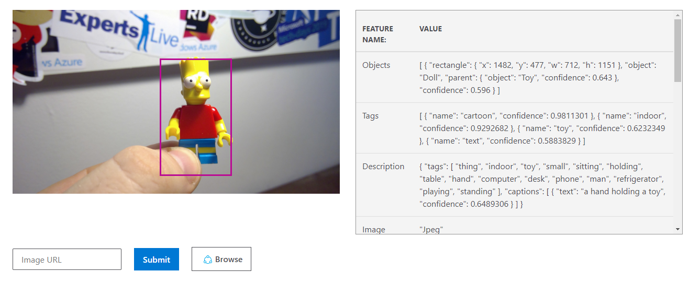

# Lab 1 - Computer Vision

Microsoft Azure Cognitive Services contain some pre-built models for the most typical tasks, such as object detection in pictures, speech recognition and synthesis, sentiment analysis and so on. Let us test the [**Computer Vision API**](https://azure.microsoft.com/services/cognitive-services/computer-vision/?WT.mc_id=gaic-github-heboelma) service to see if it can recognize some specific objects in one particular problem domain.

Suppose we need to create an application that recognizes Simpson Lego Figures:

We will use the [Simpsons Lego Figure Dataset](https://github.com/hnky/dataset-lego-figures) from Henk Boelman.

Let us start by looking at how pre-trained [Computer Vision cognitive service](https://azure.microsoft.com/services/cognitive-services/computer-vision/?WT.mc_id=gaic-github-heboelma) can see our images:

### Create the CognitiveService account

```
az cognitiveservices account create --name ComputerVision --resource-group cognitive-rg --kind ComputerVision --sku F0 --location westeurope --yes
``` 

* Go to the home page of [Computer Vision Service](https://azure.microsoft.com/services/cognitive-services/computer-vision/?WT.mc_id=gaic-github-heboelma)
* Scroll down to **See it in action** section
* Paste the link below in the **Image URL** field and click **Submit**.

  ```text
  https://raw.githubusercontent.com/hnky/dataset-lego-figures/master/_test/Bart.jpg
  ```

* Observe how the image has been classified:



While some of the objects \(such as Toy\) can be recognized by the pre-trained model, more specialized objects \(like this is Bart Simpson or Marge Simpson\) are not determined correctly.

[**Continue with lab 2 &gt;**](lab-2.md)

